<div align="center">

# QuickCare

### NHS care — clearly explained, for everyone

[](https://python.org)
[](https://fastapi.tiangolo.com)
[](https://anthropic.com)
[](https://azure.microsoft.com)
[](https://www.england.nhs.uk)
[](./SECURITY.md)
[](./.github/workflows/ci.yml)
[](./LICENCE)

**Your NHS. Your language. Your health — clearly explained.**

</div>

---

## The Problem

Over **8 million people** in the UK speak English as a second language. Every day, they:

- Receive prescriptions they cannot fully understand
- Miss doses because instructions are unclear
- Avoid booking GP appointments because the process feels too complex
- Leave consultations unsure of what the doctor actually said
- Attend A&E when a pharmacist or NHS 111 would have been appropriate

This is not a lack of intelligence. It is a **lack of access**.

---

## The Solution

QuickCare sits alongside existing NHS infrastructure and makes it accessible to everyone — regardless of language, literacy, or digital confidence.

| Feature | What it does |
|---|---|
| **Prescription explainer** | Photograph your prescription — AI explains each medicine in plain language, dosage, side effects and warnings in your language |
| **Medication reminders** | Smart push notifications personalised to your prescription and daily routine |
| **Appointment booking** | Book GP appointments by voice or text, integrated with NHS Login |
| **Multilingual voice interface** | Speak in your language, receive answers in your language |
| **Drug interaction checker** | Flags dangerous combinations across multiple medications — in the patient's native language |
| **NHS wait time navigator** | Real-time A&E and UTC wait times with AI triage guidance |
| **Post-appointment summary** | Voice note summary of every consultation delivered to the patient |
| **Culturally-aware mental health signposting** | Mental health guidance adapted to cultural context, not just translated |

---

## System Architecture

<div align="center">



</div>

> [View Interactive Architecture](https://TFT444.github.io/QuickCare/docs/architecture.html) — full animated walkthrough on GitHub Pages

---

## How It Works

```
Patient (voice · photo · text)
        │
        ▼
  FastAPI route
        │
        ├─── parser.py      ← OCR extracts prescription text from image
        │
        ├─── lang_detect.py ← Auto-detects patient language (no manual selection)
        │
        ├─── ai_engine.py   ← Claude API: plain-language explanation in target language
        │
        ├─── safety.py      ← Blocks diagnostic claims · appends disclaimer · SHA-256 audit log
        │
        └─── JSON response  ← explanation · medications · warnings · disclaimer
```

---

## Roadmap

### Phase 1 — MVP `Months 1–4`
- [ ] Prescription photo upload and AI explanation engine
- [ ] 10-language multilingual output: Urdu · Bengali · Somali · Polish · Punjabi · Arabic · Tamil · Romanian · Gujarati · English
- [ ] Medication reminder system with push notifications
- [ ] Voice interface — speak and receive responses in native language
- [ ] Basic authentication and profile management
- [ ] Mobile-first Progressive Web App

### Phase 2 — Validate `Months 4–8`
- [ ] NHS Login API integration
- [ ] GP appointment booking via voice and text
- [ ] Real user pilot — 50–100 users from language barrier communities
- [ ] Accuracy measurement and clinical safety audit
- [ ] GDPR compliance review and NHS DSPT alignment
- [ ] Pilot data collection and reporting

### Phase 3 — Innovate `Months 8–14`
- [ ] Drug interaction checker — multilingual, voice-enabled
- [ ] NHS A&E and UTC wait time navigator with AI triage
- [ ] Post-appointment consultation summary (voice note delivery)
- [ ] Culturally-aware mental health signposting
- [ ] NHS 111 and GP Connect FHIR R4 integration
- [ ] DCB0129 clinical safety case documentation

### Phase 4 — NHS Pitch `Months 14–20`
- [ ] NHS AI Lab application
- [ ] Accelerated Access Collaborative submission
- [ ] Innovate UK grant application
- [ ] Academic Health Science Network engagement
- [ ] NHS pilot programme proposal and IP licensing pathway

---

## Tech Stack

| Layer | Technology |
|---|---|
| Backend | Python 3.11, FastAPI |
| AI / NLP | Claude API (Anthropic), OpenAI Whisper (STT), Azure TTS |
| Database | PostgreSQL + SQLAlchemy, Redis |
| Infrastructure | Azure (NHS preferred cloud partner) |
| Authentication | NHS Login OAuth 2.0, JWT |
| Compliance | GDPR, NHS DSPT, DCB0129 |
| Mobile | Progressive Web App (PWA) |
| CI/CD | GitHub Actions |

---

## Security

QuickCare treats security as a first principle — not an afterthought.

| Control | Implementation |
|---|---|
| Authentication | JWT Bearer tokens on all routes |
| Rate limiting | 30 req/min per IP — `src/api/middleware/rate_limit.py` |
| Input validation | Pydantic schemas on every endpoint |
| AI output guardrails | `src/core/safety.py` — blocks diagnostic claims and dose changes |
| Audit logging | SHA-256 hash of every AI output, structured JSON logs |
| Secrets management | Environment variables only — `.env.example` documents all keys |
| Dependency scanning | Bandit + TruffleHog + pip-audit on every CI run |

### Branch Protection

| Rule | Setting |
|---|---|
| Push to `main` | Blocked — PRs only |
| PR approval required | Minimum 1 review from `@TFT444` |
| Status checks required | CI must pass before merge |
| Force push to `main` | Disabled |
| Branch deletion of `main` | Disabled |

All new work branches from `dev`. Only reviewed, tested, and approved code reaches `main`.

Found a vulnerability? Read [SECURITY.md](./SECURITY.md) before opening a public issue.

---

## Clinical Safety

- Every AI response carries a mandatory disclaimer in the patient's language: *"This information is for guidance only. Always consult your pharmacist or GP for medical advice."*
- No diagnostic claims are made at any point
- Drug interaction checker outputs are validated against BNF (British National Formulary) data
- DCB0129 clinical safety case to be completed prior to any NHS deployment
- All outputs pass through `src/core/safety.py` before reaching the patient

---

## Compliance

| Standard | Status |
|---|---|
| GDPR (UK) | In design |
| NHS DSPT | In design |
| DCB0129 Clinical Safety | Planned — Phase 3 |
| ISO 27001 | Planned — Phase 4 |
| NHS Login Integration | Planned — Phase 2 |
| FHIR R4 | Planned — Phase 3 |

---

## NHS Alignment

QuickCare directly supports NHS England strategic priorities:

- **Core20PLUS5** — addressing health inequalities in the most deprived communities
- **NHS Long Term Plan** — digital transformation and access improvement
- **NHS App roadmap** — extending NHS digital services to underserved populations
- **NHSE Health Inequalities Improvement Programme** — language as a barrier to access

---

## Supported Languages — Phase 1

English · Urdu · Bengali · Somali · Polish · Punjabi · Arabic · Tamil · Romanian · Gujarati

*Further languages added based on NHS population data and community need.*

---

## Contributing

All contributions go into `dev`. No direct pushes to `main`.

Please read [CONTRIBUTING.md](./CONTRIBUTING.md) before opening a pull request. All contributions follow the issue-first workflow: open an issue, branch from `dev`, submit a PR, await review from `@TFT444`.

---

## Authors

**Tanvir Farhad** — Founder & Lead Engineer  
BSc Computing Systems, Ulster University London  
Founder of [RetailShield](https://retail-shield.vercel.app) and ShieldTech Ltd  
AI & Scanner Rules Lead, OpenShield (OWASP-listed)  
[github.com/TFT444](https://github.com/TFT444)

**Emon** — Co-Author & Contributor

---

## Disclaimer

QuickCare is not a medical device. It does not diagnose, treat, or prescribe. All health information is for guidance only. Always consult a qualified healthcare professional for medical advice.

---

## Licence

Copyright © 2026 QuickCare / ShieldTech Ltd. All rights reserved.  
*Licence to be determined prior to public release.*
