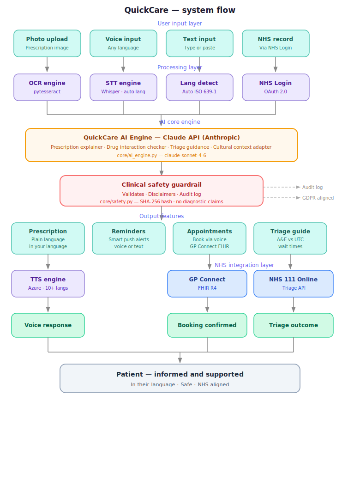

<div align="center">

# QuickCare

### AI-powered NHS healthcare companion — breaking language barriers for 8 million UK residents

[](https://python.org)
[](https://fastapi.tiangolo.com)
[](https://anthropic.com)
[](https://azure.microsoft.com)
[](./LICENCE)
[](https://www.england.nhs.uk)
[](./SECURITY.md)
[](./.github/CODEOWNERS)

> **Your NHS. Your language. Your health — clearly explained.**

</div>

---

## 📌 Overview

QuickCare sits alongside existing NHS infrastructure and makes it accessible to everyone — regardless of language, literacy, or digital confidence.

Patients photograph or dictate their prescription, and QuickCare explains it in plain language in their native tongue. No jargon. No confusion. No unnecessary A&E visits.

---

## 🚨 The Problem

Over **8 million people** in the UK speak English as a second language. The NHS App, GP systems, and pharmacy services are built almost entirely in English. Every day, patients:

- Receive prescriptions they cannot fully understand
- Miss medication doses due to confusion over instructions
- Avoid booking GP appointments because the process feels too complex
- Leave consultations unsure of what the doctor actually said
- Reach for A&E when a pharmacist or NHS 111 would have been appropriate

This is not a lack of intelligence. It is a **lack of access**.

---

## 💡 The Solution

| Feature | What it does |
|---|---|
| **Prescription explainer** | Photograph or receive prescription digitally — AI explains each medicine in plain language, dosage, side effects, and warnings |
| **Medication reminders** | Smart push notifications tied to prescription data, personalised timing |
| **Appointment booking** | Integrated with NHS Login API — book GP appointments by voice or text |
| **Multilingual voice interface** | Speak in your language, receive answers in your language |
| **Drug interaction checker** | Flags dangerous combinations across multiple medications — in the patient's native language |
| **NHS wait time navigator** | Real-time A&E and UTC wait times with AI triage guidance |
| **Post-appointment summary** | Voice note summary of the consultation sent to the patient after every GP visit |
| **Culturally-aware mental health signposting** | Mental health guidance adapted to cultural context, not just translated |

---

## 👥 Who It Is For

QuickCare is built for everyone. The primary beneficiaries are:

- UK residents whose first language is not English
- Elderly patients who find NHS digital services difficult to navigate
- Carers managing health for family members
- Anyone who has ever left a GP appointment confused about what happens next

---

## 🏗 Architecture Overview



```
┌─────────────────────────────────────────────────────┐
│                    QuickCare Platform                │
├──────────────┬──────────────┬───────────────────────┤
│  Voice Layer │   API Layer  │    Integration Layer  │
│              │              │                       │
│  STT Engine  │  FastAPI     │  NHS Login API        │
│  TTS Engine  │  REST/JSON   │  NHS FHIR R4          │
│  Lang detect │  Auth/JWT    │  GP Connect           │
│              │              │  NHS 111 Online       │
├──────────────┴──────────────┴───────────────────────┤
│                    Core AI Engine                    │
│                                                     │
│  Prescription Parser  │  Drug Interaction Checker   │
│  Multilingual NLP     │  Triage Decision Support    │
│  Cultural Context     │  Appointment Optimiser      │
├─────────────────────────────────────────────────────┤
│                  Data & Compliance                   │
│                                                     │
│  GDPR-compliant storage  │  NHS DSPT aligned        │
│  End-to-end encryption   │  ISO 27001 ready         │
│  Audit logging           │  DCB0129 clinical safety │
└─────────────────────────────────────────────────────┘
```

---

## 🗺 Roadmap

### Phase 1 — MVP (Months 1–4)
- [ ] Prescription photo upload and AI explanation engine
- [ ] Multilingual output — 10 languages (Urdu, Bengali, Somali, Polish, Punjabi, Arabic, Tamil, Romanian, Gujarati, English)
- [ ] Medication reminder system with push notifications
- [ ] Voice interface — speak and receive responses in native language
- [ ] Basic user authentication and profile management
- [ ] Mobile-first web app (PWA)

### Phase 2 — Validate (Months 4–8)
- [ ] NHS Login API integration
- [ ] GP appointment booking via voice and text
- [ ] Real user pilot — 50–100 users from language barrier communities
- [ ] Accuracy measurement and safety audit
- [ ] GDPR compliance review
- [ ] NHS DSPT (Data Security and Protection Toolkit) alignment
- [ ] Pilot data collection and reporting

### Phase 3 — Innovate (Months 8–14)
- [ ] Drug interaction checker — multilingual, voice-enabled
- [ ] NHS A&E and UTC wait time navigator with AI triage guidance
- [ ] Post-appointment consultation summary (voice note delivery)
- [ ] Culturally-aware mental health signposting
- [ ] NHS 111 integration
- [ ] GP Connect FHIR R4 integration for medical record access
- [ ] DCB0129 clinical safety case documentation

### Phase 4 — NHS Pitch (Months 14–20)
- [ ] NHS AI Lab application
- [ ] Accelerated Access Collaborative submission
- [ ] Innovate UK grant application
- [ ] Academic Health Science Network (AHSN) engagement
- [ ] NHS pilot programme proposal
- [ ] IP licensing or acquisition pathway

---

## 🛠 Tech Stack

| Layer | Technology |
|---|---|
| Backend | Python 3.11, FastAPI |
| AI / NLP | Claude API (Anthropic), Whisper (STT), Azure TTS |
| Database | PostgreSQL, Redis (caching) |
| Infrastructure | Azure (NHS preferred cloud partner) |
| Authentication | NHS Login OAuth 2.0, JWT |
| Compliance | GDPR, NHS DSPT, DCB0129 |
| Mobile | Progressive Web App (PWA) |
| CI/CD | GitHub Actions |

---

## 📁 Repository Structure

```
QuickCare/
├── src/
│   ├── api/                    # FastAPI routes and middleware
│   │   ├── routes/
│   │   │   ├── prescriptions.py
│   │   │   ├── appointments.py
│   │   │   ├── reminders.py
│   │   │   └── voice.py
│   │   └── middleware/
│   │       ├── auth.py
│   │       └── rate_limit.py
│   ├── core/                   # Core business logic
│   │   ├── ai_engine.py        # Claude API integration
│   │   ├── drug_checker.py     # Drug interaction logic
│   │   ├── triage.py           # NHS triage decision support
│   │   └── safety.py           # Clinical safety guardrails
│   ├── voice/                  # Voice interface layer
│   │   ├── stt.py              # Speech to text (Whisper)
│   │   ├── tts.py              # Text to speech (Azure)
│   │   └── lang_detect.py      # Language detection
│   ├── prescriptions/          # Prescription processing
│   │   ├── parser.py           # OCR and AI parsing
│   │   ├── explainer.py        # Plain language explanation
│   │   └── validator.py        # Clinical validation
│   ├── reminders/              # Medication reminder system
│   │   ├── scheduler.py
│   │   └── notifications.py
│   ├── appointments/           # NHS appointment booking
│   │   ├── nhs_login.py        # NHS Login OAuth
│   │   ├── gp_connect.py       # GP Connect FHIR API
│   │   └── booking.py
│   └── i18n/                   # Multilingual support
│       ├── translations/
│       └── cultural_context.py
├── tests/
│   ├── unit/
│   ├── integration/
│   └── clinical/               # Clinical accuracy test suite
├── docs/
│   ├── ARCHITECTURE.md
│   ├── NHS_COMPLIANCE.md
│   ├── CLINICAL_SAFETY.md
│   └── API_REFERENCE.md
├── infrastructure/
│   ├── azure/
│   └── docker/
├── .github/
│   ├── workflows/
│   │   ├── ci.yml
│   │   └── security_scan.yml
│   ├── ISSUE_TEMPLATE/
│   │   ├── bug_report.md
│   │   └── feature_request.md
│   ├── pull_request_template.md
│   └── CODEOWNERS
├── SECURITY.md
├── CONTRIBUTING.md
├── .env.example
├── requirements.txt
├── Dockerfile
└── README.md
```

---

## 🔒 Security

QuickCare treats security as a first principle — not an afterthought. The security model is layered across the codebase, infrastructure, and development workflow.

### Application Security

| Control | Implementation |
|---|---|
| Authentication | JWT Bearer tokens on all routes |
| Rate limiting | 30 req/min per IP — `src/api/middleware/rate_limit.py` |
| Input validation | Pydantic schemas on all endpoints |
| AI output guardrails | `src/core/safety.py` — blocks diagnostic claims, dose changes |
| Audit logging | SHA-256 hash of every AI output, structured JSON logs |
| Secrets management | Environment variables only — `.env.example` documents all keys |
| Dependency scanning | Bandit + TruffleHog on every CI run |

### Branch Protection

| Rule | Setting |
|---|---|
| Push to `main` | ❌ Blocked — PRs only |
| Push to `dev` | ✅ Allowed for contributors |
| PR approval required | ✅ Minimum 1 review from `@TFT444` |
| Status checks required | ✅ CI must pass before merge |
| Force push to `main` | ❌ Disabled |
| Branch deletion of `main` | ❌ Disabled |

> All new code goes into `dev`. Only reviewed, tested, and approved code is merged into `main`.

### Vulnerability Reporting

Found a security issue? Please read our [SECURITY.md](./SECURITY.md) before opening a public issue.

---

## 🏥 Clinical Safety

QuickCare is designed with clinical safety as a first principle.

- All AI-generated content carries a mandatory disclaimer: *"This information is for guidance only. Always consult your pharmacist or GP for medical advice."*
- No diagnostic claims are made at any point
- Drug interaction checker outputs are validated against BNF (British National Formulary) data
- DCB0129 clinical safety case will be completed prior to any NHS deployment
- All outputs are reviewed by a clinical governance framework before production release

---

## ✅ Compliance

| Standard | Status |
|---|---|
| GDPR (UK) | In design |
| NHS DSPT | In design |
| DCB0129 Clinical Safety | Planned Phase 3 |
| ISO 27001 | Planned Phase 4 |
| NHS Login Integration | Planned Phase 2 |
| FHIR R4 | Planned Phase 3 |

---

## 🌍 NHS Alignment

QuickCare directly supports the following NHS England strategic priorities:

- **Core20PLUS5** — addressing health inequalities in the most deprived communities
- **NHS Long Term Plan** — digital transformation and access improvement
- **NHS App roadmap** — extending NHS digital services to underserved populations
- **NHSE Health Inequalities Improvement Programme** — language as a barrier to access

---

## 🌐 Supported Languages (Phase 1)

English · Urdu · Bengali · Somali · Polish · Punjabi · Arabic · Tamil · Romanian · Gujarati

*Further languages added based on NHS population data and community need.*

---

## 🤝 Contributing

All contributions flow through `dev`. No direct pushes to `main` are permitted.

Please read [CONTRIBUTING.md](./CONTRIBUTING.md) before opening a pull request.

---

## 👤 Authors

**Tanvir Farhad** — Founder & Lead Engineer  
BSc Computing Systems, Ulster University London  
Founder of [RetailShield](https://retail-shield.vercel.app) and ShieldTech Ltd  
AI & Scanner Rules Lead, OpenShield (OWASP-listed)  
[github.com/TFT444](https://github.com/TFT444)

**Emon** — Co-Author & Contributor

---

## ⚠️ Disclaimer

QuickCare is not a medical device. It does not diagnose, treat, or prescribe. All health information provided is for guidance only. Users should always consult a qualified healthcare professional for medical advice.

---

## 📄 Licence

Copyright © 2026 QuickCare / ShieldTech Ltd. All rights reserved.  
*Licence to be determined prior to public release.*
